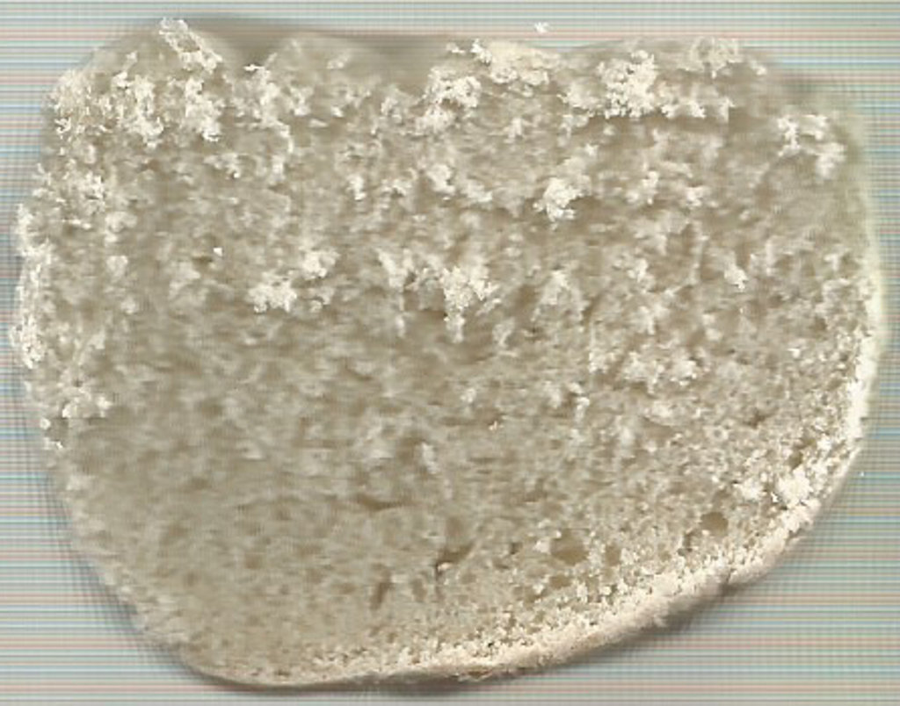
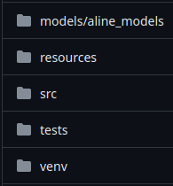
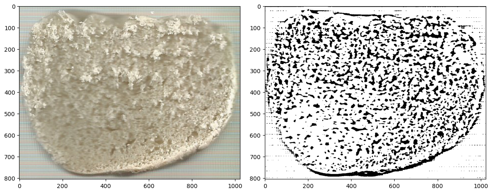
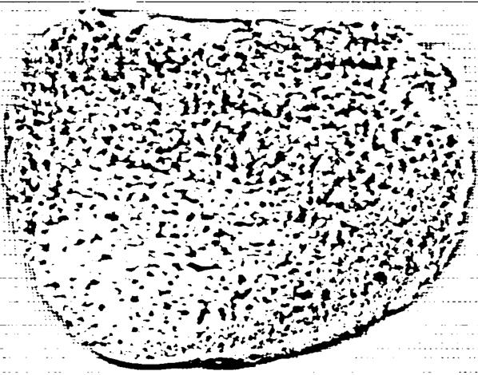
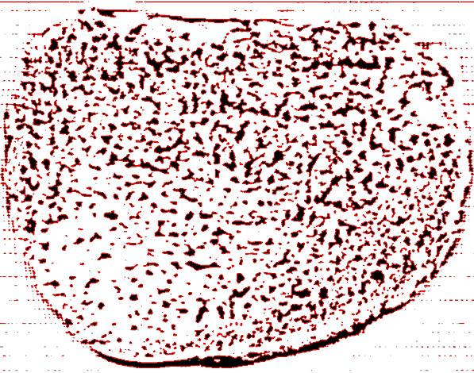

# PIBIC - AVALIAÇÕES DAS PROPRIEDADES FÍSICAS DA MASSA E DE PÃES ELABORADOS COM ADIÇÃO DE FARINHAS DE BIOMASSA DE BANANA E DE SOJA

### Grande área de conhecimento: Ciências Exatas e da Terra

### Subárea do conhecimento: Química

### Orientado: Vitor Kauã Oliveira de Souza, Segundo ano de Ciência da Computação, Universidade Estadual do Norte do Paraná

### Orientador: Professor Doutor Luís Guilherme Sachs

### 11,30,2023
---

## Documentação 

O seguinte arquivo se trata da documentação da implementação e execução de um analizador de cluster de imagens de fatias de pães.

Ele não pretende substituir o documento original da Proposta da Iniciação Científica e sim ser um complemento ao software desenvolvido.

Ele busca, além da documentação do software, introduzir minimamente o projeto como um todo.

---

## Índice

1. Introdução
2. Objetivo
3. Pre-análise
    1. Desenvolvimento dos experimentos
    2. Obtenção das imagens
4. Pre-desenvolvimento
    1. Linguagem
    2. Ambiente virtual
    3. Dependencias
5. Desenvolvimento
    1. Estrutura do projeto
    2. Diretórios
    3. Main.ipynb
    4. Auto.py
6. Conclusão
7. Referencias

---

### 1. Introdução

Esse documento se trata de uma documentação referente ao software desenvolvido para o PIBIC "AVALIAÇÕES DAS PROPRIEDADES FÍSICAS DA MASSA E DE PÃES ELABORADOS COM ADIÇÃO DE FARINHAS DE BIOMASSA DE BANANA E DE SOJA".

O PIBIC busca a realização de experimentos, no caso pães, onde cada experimento possuem 3 variáveis, as quais os valores de cada uma podem variar entre um valor mínimo, médio e máximo cada um.

Após a realização dos experimentos, é realizada a analise química e após a análise química e feita a analise gráfica, computacional, dos experimentos utilizando o software desenvolvimento.

O software desenvolvido pretende realizar a análise gráfica computacional analisando a imagem obtida de cada um. Ele procura analisar os agrupamentos de ar presentes nos experimentos para dessa forma termos a qualidade deles.

### 2. Objetivo

O objetivo geral do projeto é o desenvolvimento de pães com substituição de trigo por biomassa de banana verde e soja. O objetivo específico procura aproveitar de bananas fora dos padrões de comercialização na elaboração de pães ricos em probióticos. Além disso, avaliar as propriedades físico-químicas dos pães elaborados.

O objetivo geral do software desenvolvido busca a análise gráfica das imagens. Quanto ao objetivo específico do software é a análise dos clusters, os agrupamentos de ar presentes dos pães, através da análise computacional das fatias dos pães, buscando dados como quantidade de clusters, maior e menor cluster e o tamanho de cada cluster presente.

### 3. Pre-análise

A etapa "Pre-análise" trata de todas as etapas do projeto anteriores ao desenvolvimento e uso do software, envolvendo de forma principal a elaboração dos experimentos e a obtenção das imagens dos experimentos.

#### 3.1 Desenvolvimento dos experimentos

Os experimentos, como já dito, se tratam do desenvolvimento de 15 pães, onde cada experimento possui três ingredientes que compoẽm a formulação, os quais variam em três valores cada ingrediente.

São desenvolvido em laboratório com todos os ingredientes devidamente pesados e medidos. Primeiramente é medido todos os ingredientes secos de um experimento e esses, são armazenados juntos em um recipiente ou envolocro.

Após os ingredientes de todos os experimentos serem medidos e armazenados, os experimentos são propriamente desenvolvidos, também seguindo metodologias rígidas.

#### 3.2 Obtenção das imagens

Após a realização dos experimentos e análise físico-química deles, é realizado um corte vertical em cada experimento, resultando então em 30 fatias de pães desenvolvidos, duas fatias de cada experimento.

Com a obtenção dessas 30 amostras, duas por experimento, a face das fatias são colocadas sobre um scanner, limitadas pela quantidade de fatias que cabem no scan. Uma vez as faces das fatias no scan, elas são scaneadas, nos fornecendo uma imagem com as faces dos pães scaneados

Uma vez com essa imagem, que possui as faces das fatias dos experimentos que cabem no scan, é realizado o recorte individual de cada imagem.

Com o recorte individual de cada experimento scaneado, é possivel utilizar essas imagens para análise.

### 4. Pre-desenvolvimento

A etapa de pre-desenvolvimento já passa a envolver e introduzir as tecnologias que irão ser utilizadas no desenvolvimento do software.

Vale destacar que, a documentação, principalmente as etapas de pré-desenvolvimento e desenvolvimento, não pretende ensinar e instruir do zero a utilizar da linguagem de programação Python, tanto em sintaxe tanto em desenvolvimento, instalar e ativar o ambiente virtual venv e executar o software propriamente dito.

A documentação pretende instruir minimamente, direcionando e explicando as etapas do desenvolvimento, assim como o pré e pós. Espera-se um minimo conhecimento em Python e ambientes virtuais para caso necessario, uma mudança no código.

#### 4.1 Linguagem

A linguagem escolhida e utilizada para o desenvolvimento do software foi Python. O peso para a escolha foi a facilidade que Python apresenta para a realização de trabalhos envolvendo análise de imagens e computação gráfica.

Além disso, Python possui uma facilidade quanto a sintaxe da linguagem, permitindo aqueles que não possuem familiaridade com linguagens de programação, o seu uso.

#### 4.2 Ambiente virtual

Quando utilizamos Python como ferramenta, devemos nos familiarizar e utilizar uma ferramenta inclusa na linguagem chamada ambiente virtual.

Os ambientes virtuais são ferramentas para gerenciar as dependencias e bibliotecas do seu projeto, permitindo a instalação, atualização e desinstalação das mesmas. 

Na Python existem alguns ambientes virtuais mas para uma utilização leve, fácil e rápida de Python, será utilizado o ambiente virtual que já vem no Python quando instalado na sua máquina, o venv.

O venv utiliza o instalador pip para instalação e desinstalação de pacotes e bibliotecas.

#### 4.3 Dependencias

Uma vez com o diretório raiz do projeto criado e dentro dele, um ambiente virtual ter sido criado e iniciado, funcionando perfeitamente, é necessario a instalação das dependencias que serão utilizadas. E são elas matplotlib, numpy e opencv-python.

### 5. Desenvolvimento

O desenvolvimento do projeto é a etapa principal, onde há o armazenamento das imagens que serão analizadas, onde são realizadas as analizes e onde serão salvas as mesmas.

#### 5.1 Estrutura do projeto

A estrutura do projeto é a forma que ele está estruturado propriamente dito dentro do diretório raiz.

#### 5.2 Diretórios

Os diretorios ou pastas do projeto organizam e estruturam o mesmo, onde cada um possui sua própria função

- Models

O diretório Models, como o próprio nome remete, possui os modelos que serão analisados. Dentro dele há três outros diretórios que possuem os experimentos dos três participantes envolvidos no PIBIC. Cada diretório, por sua vez, possui outros que armazenam os dados de cada experimento. 

Por exemplo, a pasta exp1 dentro de aline_models, tem as duas fatias do experimento 1 e todos os dados resultantes da analise das duas fatias. Isso tudo, do experimento da Aline.

- Resources

O diretório Resources tem a função de armazenar recursos a serem utilizados ou que já foram utilizados como imagens e outros.

- Src

Src ou source se trata do diretório que possui o código-fonte do nosso projeto. Nesse caso, o source possui dois códigos: um desenvolvido inicialmente com extensão .ipynb, o principal, que utiliza a ferramenta de desenvolvimento Jupyter Notebook e um segundo, auto.py, que se trata do mesmo código em Python puro, que foi desenvolvido para a execução automática da análise de todos os modelos de um conjunto de experimentos

- Tests

Diretório usado na fase extremamente inicial do projeto, para testar questões basicas da análise da imagem, retorno de outra imagem e formas de salvar novas.

- Venv

Diretório onde está o ambiente virtual do projeto, com todas bibliotecas e dependencias.

#### 5.3 Main.ipynb

O arquivo chamado 'main.ipynb' se trata do 'cluster_analysis_pibic.ipynb' mas a fim de tornar prática a sua menção na documentação, será chamado de main.ipynb.

- Extensão

Inicialmente, o arquivo possui extensão .ipynb, que se trata da extensao utilizada pelo ambiente de desenvolvimento Jupyter Notebook, que divide de forma estratégica o código em células, que podem ser executadas individualmente, sem ter a necessidade de compilar o código inteiro para testar um único feature.

A utilização de células permite a explicação do código por células.

- 1º célula

Tem como objetivo passar o caminho explicito de onde estão as dependencias, modulos e bibliotecas que serão utilizadas no projeto.

    import os
    os.sys.path
    import sys
    path_to_module = "../venv/lib/python3.11/site-packages/"
    sys.path.append(path_to_module)

Nesse caso, o código referencia o diretório do ambiente virtual onde estão os pacotes.

- 2º célula

Importa todas as bibliotecas que serão utilizadas para o nosso arquivo propriamente dito. Apesar de estarem instaladas no venv, nós temos que importa-las em nosso código para fazer as suas utilizações.

    import cv2
    import matplotlib.pyplot as plt
    import numpy as np
    import csv

- 3º célula

Provavelmente a célula mais importante do código.

Na primeira linha é passado o caminho para a imagem a ser analisada por essa célula. Na segunda, a imagem é convertida para escalas de cinza e a terceira aplica um "blurr" na imagem, responsável por reduzir ruídos e dados desnecessários na imagem.

    img = cv2.imread('./../models/aline_models/exp1/1_1.jpg')
    gray = cv2.cvtColor(img, cv2.COLOR_BGR2GRAY)
    blurred = cv2.GaussianBlur(gray, (7, 7), 0)

A próxima estrutura é a criação de uma máscara para a imagem. Define uma variável que recebe a função que aplica um "trichute" adaptativo na imagem em escala de cinza com "blurr" aplicado a ela. Neste caso, cv2.ADAPTIVE_THRESH_MEAN_C indica que o limiar é calculado como a média dos valores dos pixels na vizinhança especificada. cv2.THRESH_BINARY indica que os pixels com intensidades acima do limiar serão definidos como 255 (branco), enquanto os pixels abaixo do limiar serão definidos como 0 (preto). Os parâmetros 31 e 10 definem o tamanho da vizinhança usada para calcular o limiar adaptativo.

    mask = cv2.adaptiveThreshold(blurred,
                                  255,
                                  cv2.ADAPTIVE_THRESH_MEAN_C,
                                  cv2.THRESH_BINARY,
                                  31,
                                  10)

A estrutura final da célula plota a imagem original e a imagem com a mascara aplicada.

- 4º célula

Tem como objetivo plotar individualmente a imagem binarizada, com a máscara aplicada, para salva-la e reutiliza-la.

- 5º/ 6º célula

Conta o número de pixeis brancos e pretos (desnecessário)

    img = cv2.imread("./../models/aline_models/exp1/1_1_bin.jpg") 
    
    number_of_white_pix = np.sum(img == 255) 
    number_of_black_pix = np.sum(img == 0) 
      
    print('Number of white pixels:', number_of_white_pix) 
    print('Number of black pixels:', number_of_black_pix)

- 7º célula

Segunda célula mais importante do código. Conta e mede o número e tamanho dos clusters da imagem binarizada.

As duas primeiras linhas definem uma lista vazia e passam o caminho da imagem a ser analisada

    areas =[]
    csv_file_path = './../models/aline_models/exp1/cluster_data_1_1.csv'

O próximo conjunto de linhas converte a imagem em escala de cinza (já está em preto e branco), aplica a binarização (já está binarizada), encontra os contornos da imagem e armazena em contours e define uma variável contadora para ter o numero de clusters (sujeito a refatoração)

    gray = cv2.cvtColor(img, cv2.COLOR_BGR2GRAY)
    ret,thresh = cv2.threshold(gray,127,255,1)
    contours,h = cv2.findContours(thresh,1,2)
    counter = 0

A próxima estrutura se trata de um laço de repetição que irá percorrer pelos contornos, salvos na lista contours. A cada iteração, ele desenha o contorno do mesmo, incrementa 1 no contador, calcula a área daquele contorno e adiciona o valor na lista areas.

    for cnt in contours:
        cv2.drawContours(img,[cnt],0,(0,0,255),1)
        counter = counter + 1
        
        # Calculate the area (number of pixels) for each contour
        area = cv2.contourArea(cnt)
        areas.append(area)

Ordena a lista areas.

    areas.sort()

A próxima estrutura cria um documento .csv para armazenar todas as informações de todos os clusters. Numero total de clusters e o valor individual da área de cada cluster.

    with open(csv_file_path, 'w', newline='') as csv_file:
        csv_writer = csv.writer(csv_file)
        csv_writer.writerow(['Exp1_1', 'Number of Total Clusters'])
        csv_writer.writerow([counter])
    
        for i, area in enumerate(areas, start=1):
            csv_writer.writerow([f'Area of Cluster{i}', area])

A imagem contornada é plotada

    plt.imshow(cv2.cvtColor(img, cv2.COLOR_BGR2RGB))
    plt.axis('off')  # Turn off axis labels and ticks
    plt.tight_layout()

A imagem plotada é salva

    plt.savefig('./../models/aline_models/exp1/1_1_bin_contours.jpg', bbox_inches='tight', pad_inches=0)
    plt.show()

### 1. As imagens

 As imagens para analise foram obtidas a partir da elaboração de pães e após a sua realização, uma fatia vertical é feita.

#### As faces das duas partes do pão cortado são escaneadas.

#### Após o scan, cada experimento é recortado individualmente, caso necessário, é corrigido o brilho, saturação e nitidez e, após isso, é recortada uma amostra de cada experimento corrigido.

#### Essa correção é realizada a fim de facilitar a analise propriamente dita, que será explicada posteriormente.

### 1.1 A análise

#### A analise propriamente dita é realizada em partes:

#### - Obtenção da imagem a ser analisada(scanner);
#### - Correção da imagem(software de edição de imagem);
#### - Trichute (binarização dos dados e cores atraves de função da biblioteca OpenCv);
#### - Obtenção da imagem preta e branca;
#### - Obtenção de uma imagem com os clusters visiveis;
#### - Contagem e analise dos clusters;

#### O trichute é realizado a partir de que, os clusters possuem, em média uma coloração mais escura o resto do pão. Dessa forma, um trichute é feito: de um valor médio minimo até um valor médio máximo dos canais RGBA, os pixeis que estiverem dentro desse minimo e máximo serão pretos e, dado outro valor médio minimo até outro valor médio mínimo dos canais RGBA, os pixeis dentro desses valores serão brancos.

#### A partir dessa nova imagem, preta e branca, com os clusters nitidos, de maneira constratada, a analise é realizada.

### 2. Implementação

### 2.1. Python

#### A linguagem escolhida para o projeto foi Python, dada a sua facilidade para tratamento de dados e imagens, possuido boas bibliotecas para o projeto.

### 2.1.1 Ambiente Virtual

#### Python depende de um ambiente virtual para desenvolvimento. Isso permite um gerenciamento total e completo das bibliotecas e dependencias do projeto, além de permitir as suas instalações propriamente ditas.

#### Para iniciar um "venv", esteja na raiz do seu projeto e digite : python -m venv "nome_do_ambiente"

#### Depois isso, para ativa-lo: source venv/bin/activate

#### Dessa forma, o ambiente estará ativado e voce estará pronto para instalar as dependencias e gerenciar o seu projeto.

### 2.1.3 Bibliotecas e dependencias

#### São usadas 3 bibliotecas de analises de imagens: opencv-python, scikit-image e Pillow;

#### para baixar cada: pip install "pacote"

### 2.2 Estruturação do projeto
 
#### O projeto, a grosso modo, é dividido em :

#### venv, o arquivo do ambiente virtual que estamos. Não iremos mudar, mexer ou alterar muitas coisas nessa diretorio, sendo praticamente 100% usando só para instalação, gerenciamente e ativação do ambiento e dependencias. 

#### Src é o source, onde teremos nosso código, ou se necessário, codigos.

#### Models, que será onde teremos cada uma das nossas imagens que serão tratadas. Irá possuir os scans originais, cada recorte de cada experimento individual, os experimentos corrigidos e as amostras dos experimentos corrigidos.

#### Resources, um diretório para armazenamento de de recursos a serem utilizados ou aqueles que ja foram e são interessantes de serem armazenados.

#### Tests, onde estão os recursos para realização dos testes do código.

### 2.3 index.ipynb

### 2.3.1 Incluindo bibliotecas

#### Inicialmente é realizada a inclusão das bibliotecas necessarias. Deve-se também, já compilar a célula, para ver se há algum erro de compilação. No meu caso, utilizando a o ambiente Jupyter Notebook, eu tive que instalar algumas dependencias do kernel jupyter para que compilasse o ambiente virtual.

### 2.3.2 Caminho das dependencias

#### Quando trabalhamos com Python, sempre trabalhamos com um ambiente virtual, o que nos permite a inportação e utilização de bibliotecas e dependencias. Só que, para garantirmos que o Kernel Python do projeto irá utilizar as importações do nosso ambiente, temos que deixarmos explicito para o projeto o caminho do ambiente que será utilizado. Observa-se que, apesar de o código como está implementado permitir que qualquer máquina, ao clonar o repositório, utilize o caminho normalmente, pode haver algum conflito e por isso, você terá de configurar e passar manualmente o caminho do ambiente.

### 2.3.3 Importação das bibliotecas

#### Após a instalação das bibliotecas no ambiente virtual, podemos importa-las no nosso código.

### 2.3.4 - Código principal

#### Uma variavel img é definida que le uma imagem que você definir. Após isso, são definidas variaveis auxiliares gray e blurred, que serviram que auxilio para a realização do trichute. Após a definição dessas variáveis, é criada a mascará, o filtro da imagem. A mascara recebe como valor a função adaptiveThreshold(trichute adaptativo) da biblioteca opencv. A função recebe como parametros o valor da variavel blurred, o valor maximo de um rgb, duas funções da biblioteca opencv, a primeira ADAPTIVE_THRESH_MEAN_C e a segunda THRESH_BINARY, por fim, os valores 31 e 10.

#### Após a mascara ter sido criada, são definidas duas variaveis que irão plotar a imagem resultante. 

#### Com isso, um laço de repetição é criado a fim de  

   
